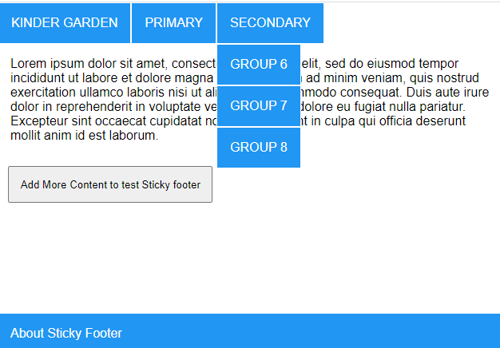

## Menu and Submenu using core web technologies

- Open Index.html in chrome and it would appear with menu and submenu which works on click event

- The footer can be pushed down by adding more content

